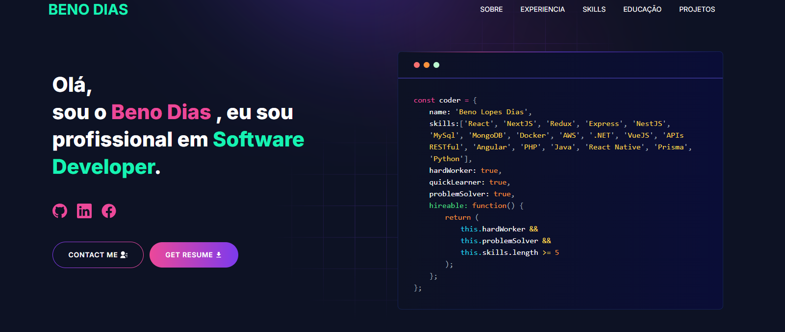

---
# [Built Portfolio With GitHub ](https://github.com/said7388/github-portfolio)
---

# Developer Portfolio

#### Are you struggling to create a professional portfolio website? Look no further! You can use the Developer Portfolio template and create your very own personalized portfolio today! My website is designed to be user-friendly and easily customizable, making it perfect for both developers and freelancers.

---

# Demo :movie_camera:



## View live preview [here](https://abusaid.netlify.app/).

---

## Table of Contents :scroll:

- [Sections](#sections-bookmark)
- [Demo](#demo-movie_camera)
- [Installation](#installation-arrow_down)
- [Getting Started](#getting-started-dart)
- [Usage](#usage-joystick)
- [Deployment](#deployment-rocket)
- [Tutorials](#tutorials-wrench)
  - [Gmail App Password Setup](#gmail-app-password-setup)
  - [Create a Telegram Bot](#create-a-telegram-bot)
  - [Fetching Blog from dev.to](#fetching-blog-from-devto)
- [Packages Used](#packages-used-package)

---

# Sections :bookmark:

- HERO SECTION
- ABOUT ME
- EXPERIENCE
- SKILLS
- PROJECTS
- EDUCATION
- BLOG
- CONTACTS

---

# Installation :arrow_down:

### You will need to download Git and Node to run this project

- [Git](https://git-scm.com/downloads)
- [Node](https://nodejs.org/en/download/)

#### Make sure you have the latest version of both Git and Node on your computer.

```bash
node --version
git --version
```

## <br />

# Getting Started :dart:

### Fork and Clone the repo

To Fork the repo click on the fork button at the top right of the page. Once the repo is forked open your terminal and perform the following commands

```bash
git clone https://github.com/<YOUR GITHUB USERNAME>/developer-portfolio.git

cd developer-portfolio
```

### Install packages from the root directory

```bash
npm install
# or
yarn install
```

Then, run the development server:

```bash
npm run dev
# or
yarn dev
```

Open [http://localhost:3000](http://localhost:3000) with your browser to see the result.

---

### Running with Docker Compose

1. **Build Docker Image and Run Container**:

   ```bash
   docker-compose up --build
   ```

2. **Access the Application**:
   Visit [http://localhost:3000](http://localhost:3000) in your web browser to view the running application.

---

### Building the Docker Image

1. **Build the Docker Image using Dockerfile.dev**:

   ```bash
   docker build -t nextjs-app -f Dockerfile.dev .
   ```

2. **Running the Docker Container**:

   ```bash
   docker run -p 3000:3000 nextjs-app
   ```

3. **Access the Application**:
   Visit [http://localhost:3000](http://localhost:3000) in your web browser to view the running application.

# Packages Used :package:

|   Used Package List    |
| :--------------------: |
|    @emailjs/browser    |
|  @next/third-parties   |
|         axios          |
|      lottie-react      |
|          next          |
|       nodemailer       |
|         react          |
|       react-dom        |
|   react-fast-marquee   |
| react-google-recaptcha |
|      react-icons       |
|     react-toastify     |
|         sharp          |
|          sass          |
|      tailwindcss       |

---

# FAQ:

1. For those facing the issue of "`next` is not recognized as an internal or external command, operable program or batch file."

Run the following command:

```bash

npm install -g next

```

This installs Next.js globally

then do the usual `npm run dev`
